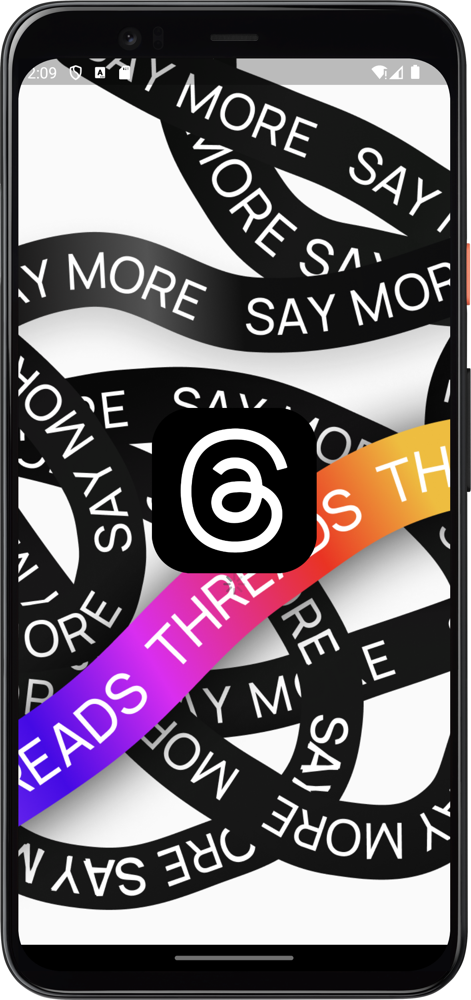

# Threads App Clone

This is a clone app of Threads app but with customized features.

## Table of Contents

* [Features](#features)
* [Setup](#setup)
* [Contribution](#contribution)
* [Technologies](#technologies)
* [Screenshots](#screenshots)

## Features

- Share what you feel today or delete what you have shared

- Customize your profile

- You can like or comment on others posts

- You can follow anyone you want

- You can have either public or private profile

## Setup

- If you are a developer, you can clone the project from the required IDEs and run it on your
  computer.
    - Clone this repository: `https://github.com/bedirhantong/threads_clone.git`
- If you want to use the application as a user, wait for the new version to be released :)

## Contribution

If you would like to contribute to this project, please follow the steps below:

1. Fork this repository.
2. Clone the forked repository on your own
   computer: `https://github.com/bedirhantong/threads_clone.git`
3. Make and test your changes.
4. Create a pull request to upload your changes.
5. After going through the review process, your changes will be merged into the main project.

## Technologies

- MVVM
- Riverpod
- Getx
- Rest API
- Asp .Net Core Web API

## Screenshots

- Onboarding Screen

|                   0000                    |                   0001                   |                   0010                   |                       0011                        |
|:-----------------------------------------:|:----------------------------------------:|:----------------------------------------:|:-------------------------------------------------:|
|  |  |  |  |

- Login and Signup Alternative and Official

|                      0000                       |                     0001                     |                  0010                  |                       0011                       |
|:-----------------------------------------------:|:--------------------------------------------:|:--------------------------------------:|:------------------------------------------------:|
|  |  |  |  |

- OTP Screen for Alternative Login Page

|                  0000                  |                        0001                        |                        0010                        |                            0011                            |
|:--------------------------------------:|:--------------------------------------------------:|:--------------------------------------------------:|:----------------------------------------------------------:|
|  |  |  |  |

- Home and Profile

|                  0000                   |                        0001                        |                        0010                        |                      0011                       |
|:---------------------------------------:|:--------------------------------------------------:|:--------------------------------------------------:|:-----------------------------------------------:|
|  |  |  |  |
